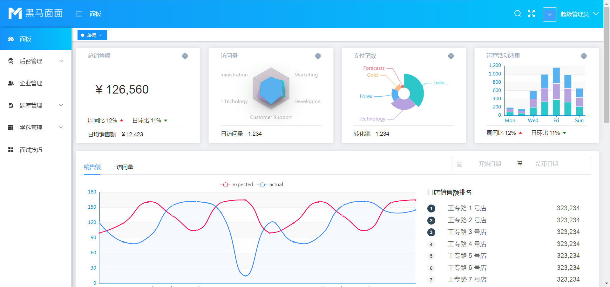

## 开发环境

### 01-后台环境

> 仓库地址：https://gitee.com/zhoushugang/hmmm-backend 

启动步骤：

1、克隆项目

```bash
git clone https://gitee.com/zhoushugang/hmmm-backend.git
```

2、安装依赖

```bash
# 进入项目hmmm-backend目录
npm i
```

3、在`MYSQL`创建数据库：

- 数据库名称必须是： `mianmian`

4、初始化表

- 项目下 `hmmm-backend/db/mianmian.sql`  是初始化SQL文件
- 在 `mianmian` 数据库下执行该文件即可

5、修改连接数据库密码

- 项目下 `hmmm-backend/config/config.default.js`  是配置文件
- 在文件 63行 处修改为当前电脑mysql数据库的密码即可

```js
    client: {
      // host
      host: process.env.DATABASE_HOST || '127.0.0.1',
      // 端口号
      port: process.env.DATABASE_PORT || '3306',
      // 用户名
      user: 'root',
      // 密码 (文件63行↓)
      password: '123456',
      // 数据库名
      database: process.env.DATABASE_DB || 'mianmian'
    },
```

6、启动项目

```bash
# 进入项目hmmm-backend目录
npm run dev
```

7、测试是否启动

- 访问 http://localhost:7001/ 如下显示代表成功

```json
{
"code": 40000,
"error": "令牌为空，请登陆获取！"
}
```


### 02-前端项目

> 仓库地址  https://gitee.com/zhoushugang/hmmm-frontend-dev 

启动步骤：

1、克隆项目

```bash
git clone https://gitee.com/zhoushugang/hmmm-frontend-dev.git
```

2、安装依赖

```bash
# 进入项目hmmm-backend目录
npm i
```

3、启动项目

```bash
# 进入项目hmmm-backend目录
npm run serve
```

4、测试项目

- 访问 http://localhost:8080/  点击登录，如下代表成功。




