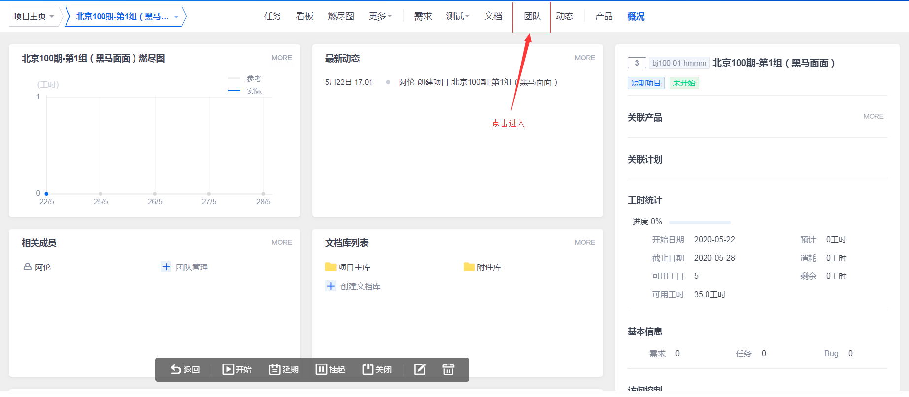

## 禅道项目任务操作

### 01-添加项目（组长）

> 此操作由项目经理（组长）完成

操作地址： http://kg-tdsz.itheima.net/zentao/project-create.html 

### 02-设置团队（组长）

> 此操作由项目经理（组长）完成

1、进入刚才创建项目的概览页面。

- 先访问  http://kg-tdsz.itheima.net/zentao/project-all-all.html  进入所有项目列表
- 找到你刚才创建的项目且进入。

2、进入刚才创建项目的团队成员列表。

3、进入刚才创建项目的团队管理页面。

4、添加成员

### 03-分配任务（组长）

> 此操作由项目经理（组长）完成

1、进入刚才创建项目的概览页面。

- 先访问  http://kg-tdsz.itheima.net/zentao/project-all-all.html  进入所有项目列表
- 找到你刚才创建的项目且进入。

2、进入刚才创建项目的任务管理列表。

3、添加任务

- 点击上图的建任务进入添加页面
- 请按照下图的标注进行添加即可

### 04-开始任务（组员）

> 此操作由开发人员（组员）完成

操作地址：http://kg-tdsz.itheima.net/zentao/my-task.html

- 备注：大家也可以按照一天 **8** 工时计算三天的预计剩余为 **24** 工时。

### 05-每日汇报（组员）

> 此操作由开发人员（组员）完成

在每天下班时间，在自己的任务页面，进行每日工作汇报。

### 06-查看进度（组员|组长）

- 备注：这个是查看功能，不需要操作，用了查看任务进度。