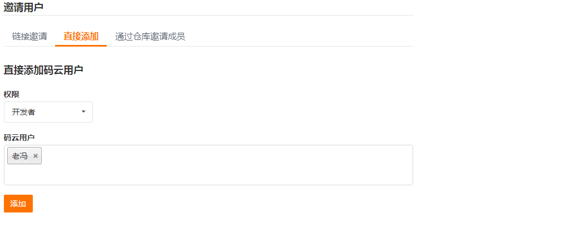

## 协同开发

### Git工作流程


### 01-项目开始（组长）

##### (1)克隆项目

- 远程仓库地址： https://gitee.com/zhoushugang/hmmm-frontend-dev 

```bash
# 在任意目录执行
git clone https://gitee.com/zhoushugang/hmmm-frontend-dev.git
```

- 如果想要运行起来请参照 [项目环境](04-项目环境.md)

##### (2)项目仓库

- 需要根据已有项目初始化属于自己小组的项目，创建不同代码分支。
- 具体步骤：
  - 删除项目中的 `.git` 文件夹
  - 初始化仓库 `git init`
  - 添加暂存区 `git add .`
  - 提交本地仓库 `git commit -m 项目初始化`
  - master分支创建release分支 `git branch release`
  - 基于master分支创建develop分支 `git branch develop`

##### (3)远程仓库

- 在码云上创建仓库


- 拉入你小组成员

点击管理


点击仓库成员管理---->点击开发者


点击添加仓库成员----->点击邀请用户------>点击直接添加



- 此处可以搜索你的小组成员，点击添加一次性添加（此操作必须，否则无仓库操作权限）


##### (4) 推送所有分支

```bash
# 添加仓库地址别名  (仓库地址仅供参考)
git remote add origin https://gitee.com/zhoushugang/hmmm-frontend-100-01.git
# 推送master分支
git push -u origin master
# 推送release分支
git push origin release
# 推送develop分支
git push origin develop
```


### 02-开发阶段

##### (1)组员克隆项目

```bash
# 在任意目录操作  (仓库地址仅供参考)
git clone https://gitee.com/zhoushugang/hmmm-frontend-100-01.git
# 拉取其他分支
git fetch git@gitee.com:zhoushugang/hmmm-frontend-100-01.git release:release
git fetch git@gitee.com:zhoushugang/hmmm-frontend-100-01.git develop:develop
```

- 如果想要运行起来请参照 [项目环境](04-项目环境.md)

##### (2)创建任务分支

```bash
# 切换到develop分支
git checkout develop
# 例如创建基础题库分支   规范(feature/功能)
git checkout -b feature/questions
```

- 分支命名枚举
  - `feature/questions`   基础题库
  - `feature/questions-choice`   精选题库
  - `feature/questions-new`   试题录入
  - `feature/randoms`   题组列表
  - `feature/subjects`  学科管理
  - `feature/directorys`  目录管理
  - `feature/tags`  标签管理
  - `feature/articles`  面试技巧

##### (3)进行开发

- 当你开发完成一个小功能需要提交代码

```bash
# 添加到暂存
git add .
# 提交本地仓库 （不需要推送到远程仓库）
git commit -m '备注'
```

##### (4)开发完毕

- 当你确认你的任务功能开发完毕后，合并到develop分支然后推送到远程

```bash
# 切换到develop分支
git checkout develop
# 拉取最新develop分支（没有配置origin直接使用仓库地址）
git pull origin develop
# 合并自己的任务分支   例如（featrue/questions）基础题库
git merge featrue/questions
# 推送develop分支 （没有配置origin直接使用仓库地址）
git push origin develop
```


### 03-测试阶段

(1)拉取远程develop分支到本地进行测试

> 这个操作组长进行，或者代课老师操作。

```bash
# 拉取最新的develop分支到本地
git pull origin develop
# 合并到release分支
git checkout release
git merge develop
# 推送合并完成的release分支到远程仓库
git push origin release
```

- 在本地进行测试，且在禅道指派bug 参照文档 [禅道BUG管理使用说明](./07-禅道BUG管理使用说明.md)

(2)组员收到指派的bug后创建修复分支进行修复

> 收到BUG的学员可以进行修复，如果不是你的BUG可指派给其他人。

- 创建修改bug的分支

```bash
# 拉取最新的release分支
git pull origin release
# 创建修改bug的分支   规范（hotfix/questions） 和开发分支命名一致功能命名
git checkout -b hotfix/questions
```

- 进行修复

```bash
# 添加暂存
git add .
# 提交本地
git commit -m '修改基础题库bug-分页错误'
# 合并分支
git checkout release
git merge hotfix/questions
# 拉取最新release分支
git pull origin release
# 推送release分支
git push origin release
```

(3)测试完毕

> 这个操作组长进行，或者代课老师操作。

```bash
# 拉取最新的develop分支到本地
git pull origin release
# 合并到release分支
git checkout master
git merge release
# 推送合并完成的release分支到远程仓库
git push origin master
```


--------------------------------------END------------------------------------------------结束咧-----------------------------------------------------


### 04-分支流程参考


对比我们的开发路线，我们是开发到测试到上线，所以和上图略有差异，所以上图仅供参考。

