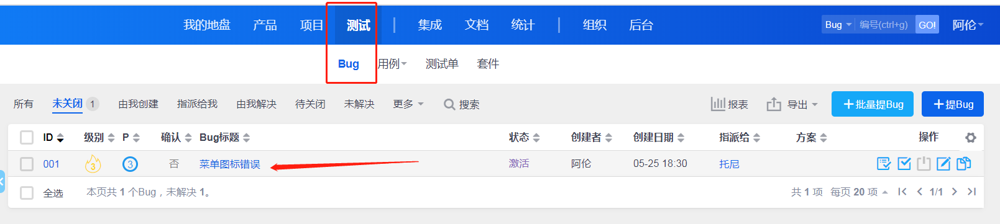

## 禅道BUG管理

### 01-指派BUG

> 此操作由项目组长或者代课讲师操作。

- 进入提Bug页面

- 录入Bug信息，指派对应的成员。

- 录入完毕后可看的bug列表

### 02-查看BUG

> 所有组员均可能收到BUG，如果在公司禅道会绑定邮箱，你将会收到BUG邮件。

- 在主页可查看属于自己的任务和bug，点击我的BUG可进入列表。

- 进入BUG列表查看

- 进入明细查看

