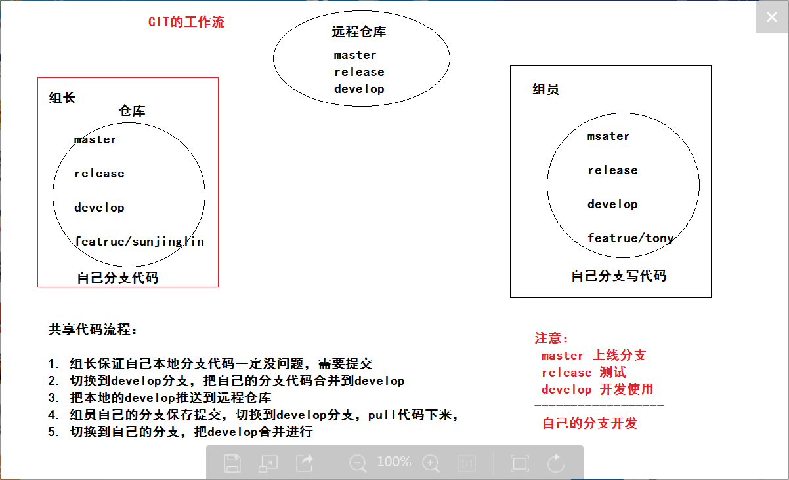
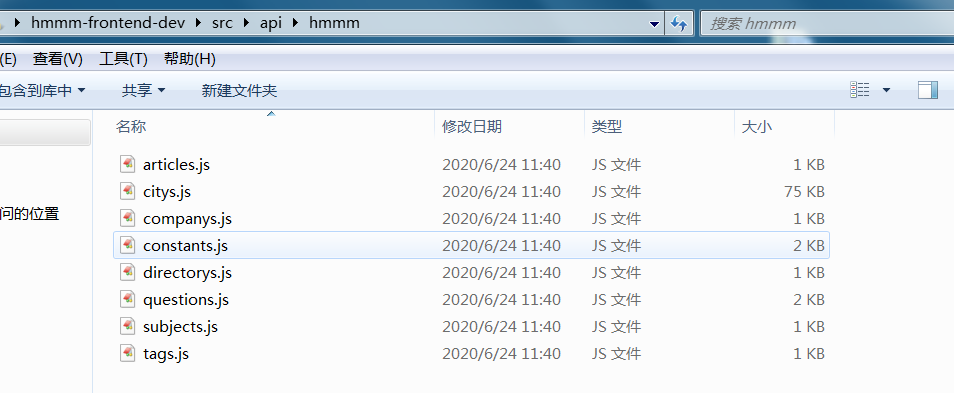
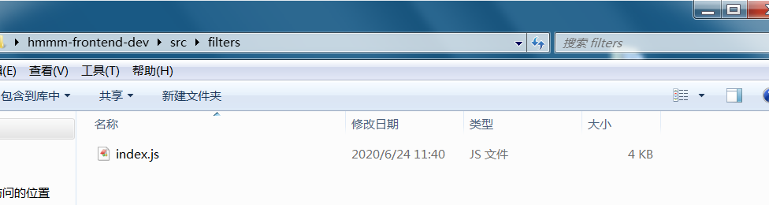
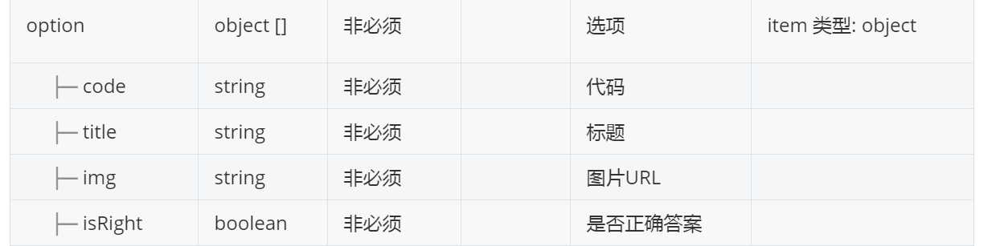
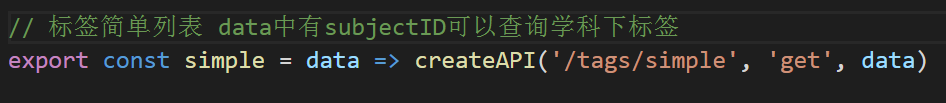
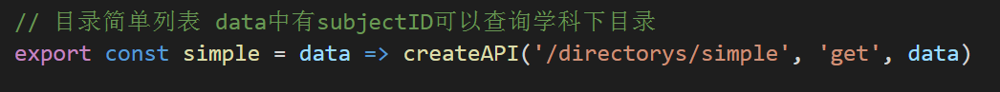
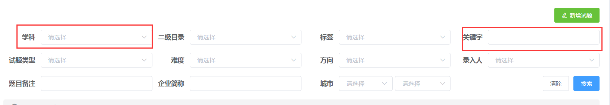
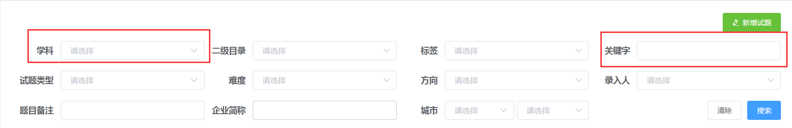

## 实战的问题汇总


### 01-分支使用问题




### 02-接口字段问题

- 接口文档上的字段解释参考为主，多一个字段，少了一个字段，字段的名字不对。
- 大家一返回的实际数据为准
- 例如：创建者
  - 接口文档---->creator
  - 实际数据----->username


### 03-接口调用的问题

- 现在的程序中，调用接口已经封装成了函数。不需要和之前全局配置axios一样。导入函数，调用函数。
- 函数的返回值就是一个promise对象，你直接拿到成功后的结果，就是数据了。
  - then()  获取数据
  - await  获取数据



- articles.js  提供面试技巧接口函数
- companys.js 提供企业管理接口函数
- directorys.js  提供二级目录接口函数
- questions.js  提供试题接口函数
- subjects.js  提供学科接口函数
- tags.js  提供标签接口函数

其他的常量数据

- citys.js  提供了城市，地区数据
- constants.js 提供了一些常量数据
  - 试题难度
  - 试题类型
  - 试题的方向
  - ...

 

### 04-参照图

- 凡是都以参照图准
- 需求文档多看看
- 今天也补充了5个参照图
  - 学科添加
  - 目录添加
    - 直接进入
    - 从学科进入
  - 标签添加
    - 直接进入
    - 从学科进入


### 05-过滤器



- 文件中函数的名字，就是过滤器的名字。
- 如果你需要过滤时间，来参照这些函数即可。


### 06-试题录入

- 试题选项





### 07-错误状态码422&500


是你在提交数据给后台的时候，参数没有提交对

- 没传
- 传的格式不对

> 大家打开控制台，去看请求的响应报文，里面会有详细的错误信息，是英文错误，翻译下。


### 08-试题状态


精选题库：

> 后台给了一项数据，publishState 意思上下架状态，0 代表下架 1 代表上架

- 试题的发布状态  
  - 已发布 （已审核+上架）
  - 已下架 （已审核+下架）
  - 待发布 （其他情况）


### 09-查询简单列表

- 获取目录简单列表



- 获取标签简单列表




默认查询的是所有的目录，所有的标签。

但是这些信息是需要和学科联动，需要根据学科查询它下面的 目录和标签

你调用这个函数的时候，需要传入学科的ID

```js
simple({subjectID:xxxx})
```


### 10-筛选条件问题

- 基础题库



- 精选题库



后台目前，只支持 学科  关键字 筛选条件查询

> 前端功能还是要实现的，参数还是按照要求提交。


### 11-已完成的同学

- 多检查一下
- 后天来合并代码


### 13-接口描述


精选题库上下架

>  基本信息

- **Path：** /questions/choice/:id/:publishState

- **Method：** POST

- **接口描述：**


>  请求参数

- **路径参数**

| 参数名称     | 示例 | 备注          |
| ------------ | ---- | ------------- |
| id           |      | 数据id        |
| publishState |      | 1 上架 0 下架 |


### 14-数据删除没了


重新执行sql文件的即可

